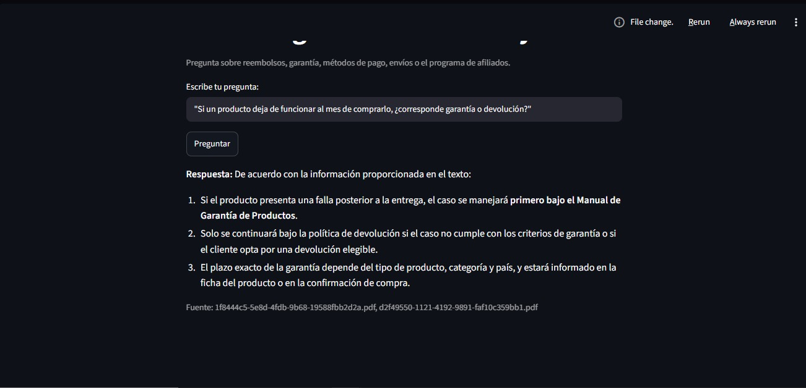

# Alura Agente – BimBam Buy

Agente de inteligencia artificial que responde preguntas en lenguaje natural
sobre los documentos internos de **BimBam Buy** (e-commerce en LATAM), sin
necesidad de abrir manualmente cada PDF.

## 📄 Descripción general

BimBam Buy tiene 5 documentos internos que su equipo de soporte y postventa
consulta todo el tiempo: política de reembolsos, garantía de productos,
métodos de pago, tiempos/costos de envío y el programa de afiliados. Este
agente permite que cualquier persona del equipo pregunte, por ejemplo,
"¿cuántos días tiene el cliente para pedir una devolución por retracto?" y
reciba la respuesta exacta, sin buscar en 5 PDFs distintos.

## 🏗️ Arquitectura de la solución

data/ (5 PDFs de BimBam Buy)
│
▼
src/loader.py ──► trocea el texto de los 5 documentos
│
▼
Embeddings locales (sentence-transformers)
│
▼
Índice vectorial FAISS (único, combina los 5 documentos)
│
▼
src/agent.py ──► RetrievalQA (LangChain) + LLM configurable
│
▼
Interfaz Streamlit (app.py) ──► desplegada en Railway
│
▼
src/logger.py ──► registra cada pregunta/respuesta en
Oracle APEX/ORDS (servicio de OCI)


Cada fragmento indexado conserva el nombre del PDF de origen, así que el
agente puede indicar de qué documento sacó cada respuesta. El registro en
OCI es "mejor esfuerzo": si el endpoint no está configurado o falla, el
agente sigue respondiendo con normalidad.

## 🛠️ Tecnologías utilizadas

- Python
- LangChain (langchain-classic para RetrievalQA) / langchain-experimental
- FAISS (búsqueda vectorial)
- sentence-transformers (embeddings locales, sin costo)
- pandas (para el modo CSV opcional, ver más abajo)
- Streamlit (interfaz web)
- Google Gemini (LLM configurado en este proyecto vía `.env`)
- Railway (hosting de la app)
- Oracle Cloud Infrastructure — Autonomous Database + APEX/ORDS (servicio de
  OCI usado para registrar los logs de cada consulta)

## ▶️ Cómo ejecutar el proyecto localmente

```bash
git clone https://github.com/B-Solary/Challenge_Alura_Agent_bimbambuy_support.git
cd Challenge_Alura_Agent_bimbambuy_support
python -m venv .venv
.\.venv\Scripts\Activate.ps1     # En Windows PowerShell
pip install -r requirements.txt

cp .env.example .env
# Edita .env con tu GOOGLE_API_KEY (ver instrucciones dentro del archivo)

# Los 5 PDF de BimBam Buy ya están en data/, listos para usar.

streamlit run app.py     # abre http://localhost:8501
```

## 📚 Documentos incluidos

| Archivo | Contenido |
|---|---|
| Política de Reembolsos y Devoluciones | Plazos, condiciones y flujo de devoluciones/reembolsos |
| Manual de Garantía de Productos | Cobertura, exclusiones y procedimiento de garantía |
| Preguntas Frecuentes sobre Métodos de Pago | Medios de pago, rechazos, reembolsos y fraude |
| Guía de Tiempos y Costos de Envío | Tiempos estimados, costos y cobertura logística |
| Programa de Afiliados | Comisiones, atribución y reglas para afiliados |

## 💬 Ejemplos de preguntas y respuestas

| Pregunta | Respuesta del agente |
|---|---|
| "¿Cuántos días tengo para devolver un producto si cambié de opinión?" | Tienes 10 días corridos para solicitar la devolución si cambiaste de opinión (derecho de retracto), siempre y cuando el producto se encuentre sin uso. |
| "¿Quién paga el envío de vuelta si el error fue de BimBam Buy?" | Si el error es atribuible a BimBam Buy, la recolección o devolución no tendrá costo para el cliente (el costo lo asume BimBam Buy). |
| "¿Cuánto tarda un reembolso una vez aprobado?" | El plazo habitual es de 5 a 10 días hábiles desde la aprobación, dependiendo del método de pago y el país. |
| "Si un producto deja de funcionar al mes de comprarlo, ¿corresponde garantía o devolución?" | Si el producto presenta una falla posterior a la entrega, el caso se maneja primero bajo el Manual de Garantía de Productos; solo se continúa bajo la política de devolución si no cumple los criterios de garantía. |

## ☁️ Despliegue

- - **URL pública (Streamlit Community Cloud):** https://challengealuraagentbimbambuysupport-8v8stjskbarsfsuw8mpn7w.streamlit.app
- **Captura de pantalla del agente funcionando:**

  

- **Servicio de OCI usado:** Oracle Autonomous Database + APEX/ORDS, para
  registrar cada pregunta/respuesta en la tabla `agent_logs`.
- **Captura de la tabla `agent_logs` con datos reales:**

El agente incluye un módulo (`src/logger.py`) preparado para registrar cada
pregunta/respuesta en un servicio externo (por ejemplo, Oracle APEX/ORDS),
mediante la variable `OCI_LOG_ENDPOINT`. Queda como mejora futura opcional;
si no se configura, el agente funciona con normalidad.

Instrucciones completas del deploy en [`deploy/DEPLOY.md`](deploy/DEPLOY.md).
## 🧩 ¿Y si quiero usar un CSV en vez de (o además de) los PDF?

El código ya soporta ambos casos: si en `.env` apuntas `DATA_PATH` a un
archivo `.csv`, el agente cambia automáticamente a un modo analítico (usa
pandas para calcular sumas, máximos, promedios, etc.) en vez de búsqueda de
texto — ideal para preguntas como "¿cuál fue el producto más vendido en
diciembre de 2015?".

## 📁 Estructura del repositorio

Challenge_Alura_Agent_bimbambuy_support/
├── README.md
├── requirements.txt
├── Procfile
├── .env.example
├── data/ # los 5 PDF de BimBam Buy
├── src/
│ ├── loader.py
│ ├── llm_providers.py
│ ├── agent.py
│ └── logger.py # registro de logs en Oracle APEX/ORDS
├── app.py # interfaz Streamlit
└── deploy/
└── DEPLOY.md


